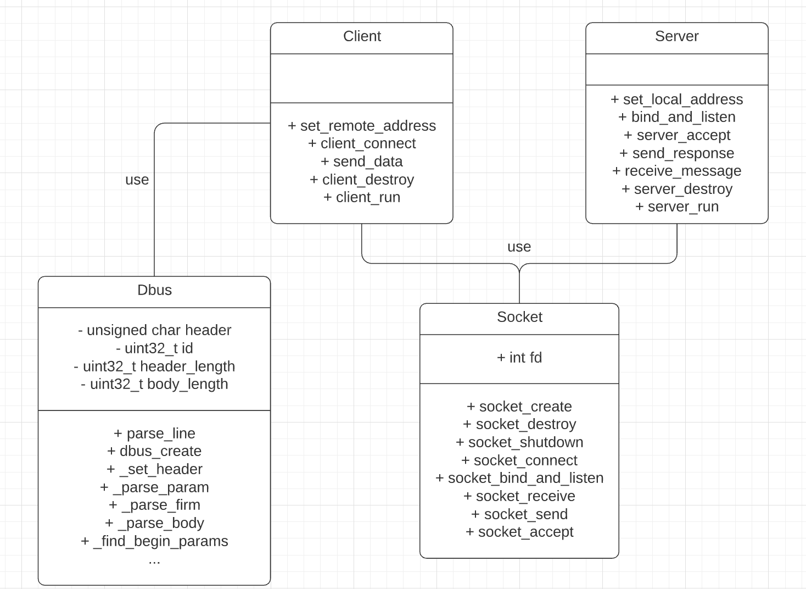

# TP1 - DBUS Protocol - Taller de Programacion 1
Alumno: Tomas Szemzo - Padrón: 97771

Link al Repositorio: https://github.com/tszemzo/dbus-protocol-tp1

## Resolución del Trabajo

Para la resolución del trabajo voy a hacer algunos comentarios a nivel global, para luego ahondar un poco más en cada módulo en particular. En primer lugar, voy a incluir un UML con el modelo utilizado para la solución. Y luego del funcionamiento de nuestro cliente-servidor TCP.

UML:

Funcionamiento del Socket cliente - servidor:

Como podemos ver en los diagramas previos, el trabajo práctico consta de la implementación de un protocolo, mediante una arquitectura cliente-servidor comunicandose a traves de un socket. Para ello, se separaron las responsabilidades en distintos TDAs o clases como queramos llamarlos: client, server, socket y dbus.

El TP tiene por objetivo que el cliente, que es el “activo” de los dos envía mensajes que lee de archivos o stdin, utilizando el protocolo dbus y luego el servidor quien los recibe debe ir procesandolos entendiendo el protocolo previamente enunciado.

Encare el problema empezando por construir mi socket, como lo fuimos viendo en clase junto con el servidor para ir testeando al mismo.  Esto es, la creación, la destrucción, la conexión, el bind & listen, etc.... No tuve demasiadas complicaciones aca ya que entre el material de la clase y los ejemplos de la documentación, me fueron de gran ayuda.

Una vez que tenía mi servidor básico funcionando y que recibía data (donde como no tenía un cliente implementado, levantaba un cliente de netcat para poder enviar mensajes), empecé por el cliente y los métodos del tda socket que me faltaban que no eran muchos… creo que send y connect. Aquí tampoco tuve mayores complicaciones, aunque al no estar acostumbrado a C, me costo un poco adaptarme al tipado estático, entre otras cosas.

Luego, empecé a implementar mi módulo del protocolo, el cual si me llevo bastante tiempo. El protocolo en sí me trajo muchas complicaciones en primer lugar porque no sabía muy bien cómo debía almacenar la tira de bytes que debía enviar, al haber distintos tipos en la misma, me confundia si debía ir haciéndolo de a partes o una “gran tira”. El approach que tomé fue de empezar por setear la parte “fija” del header que es siempre igual y fui haciéndolo byte a byte, de modo de no equivocarme, aunque el código es un poco engorroso en algunas partes.

Una vez que logre setear la parte fija del header, empecé a procesar lo que serian los distintos parámetros y bueno, aquí es donde hay una lógica tal vez un poco más jugosa y donde entran en juego más variables. Básicamente para cada parámetro en un orden que establece de forma arbitraria calculo su offset o largo, lo parseo agregando su metadata y luego el string correspondiente y voy avanzando mi posición actual en la tira de bytes equivalente a la metadata + el offset para pasar al proximo y asi sucesivamente.

Por último, logré parsear también el body en caso de que hubiere parámetros en la firma, y poder enviarlos de a chunks. 

Como hago los envios y receives? Basicamente realizó un primer envío del largo del header, y un segundo envío del largo del body. Del otro lado, en el servidor, la recepción la hago, primero pidiendo 16 bytes que corresponden a la metadata de lo que quiero recibir para poder obtener el largo del body y el header, y luego pido los bytes restantes de la tira una vez obtenida esta metadata.

Si bien pude finalizar el TP sin leaks de memoria, con el lint corriendo bien y con todos los ejemplos de prueba funcionando, no pude terminar de hacer las correcciones que me fueron marcadas, y quedarian para una futura iteracion. Estas son:

* Mejorar el socket.
* Hacer que el servidor y el cliente sean un TDA, si bien cada uno tiene su main y corre por separado.
* Mejorar la documentacion, sobretodo del modulo dbus.
* Desencapsular la pequeña logica que quedo del socket en el servidor y el cliente.
 
